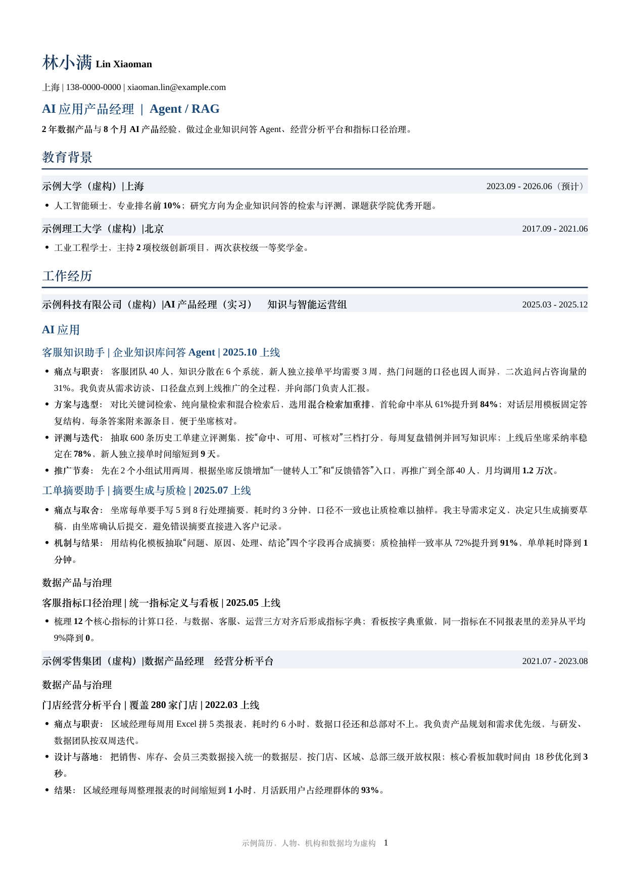
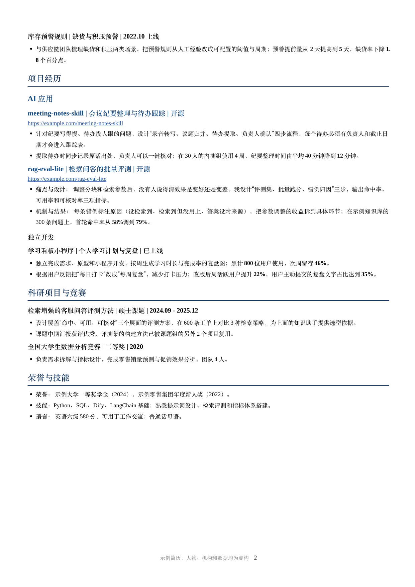
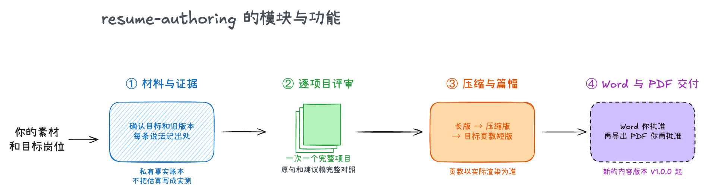
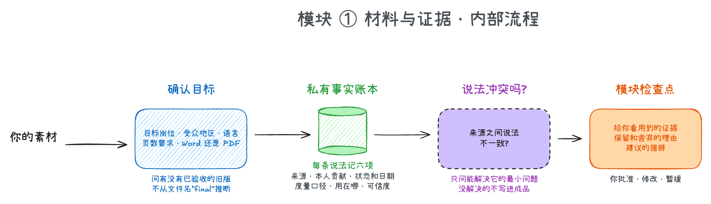
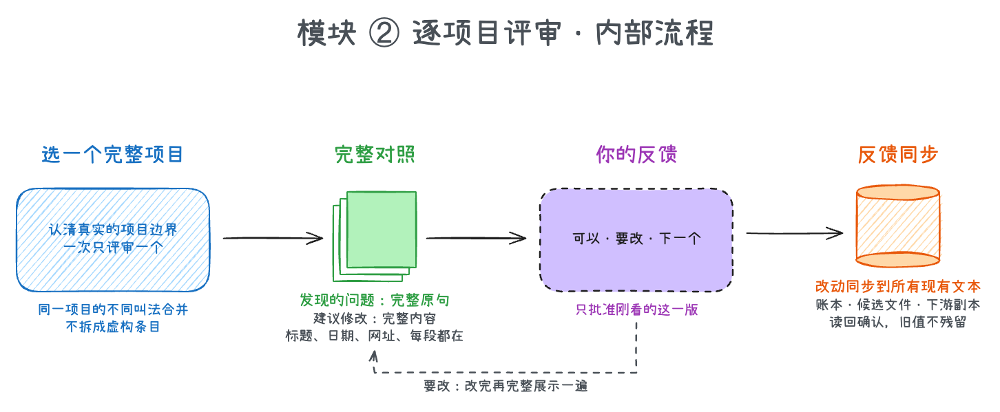
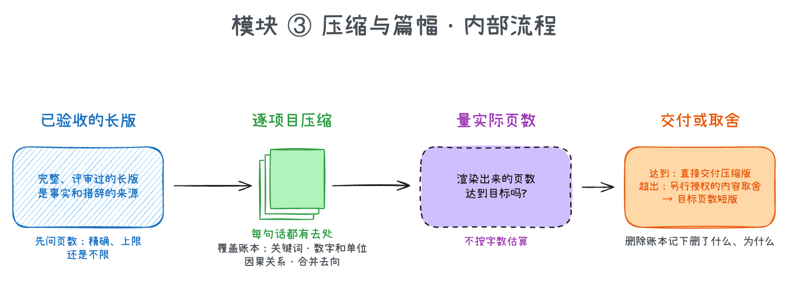
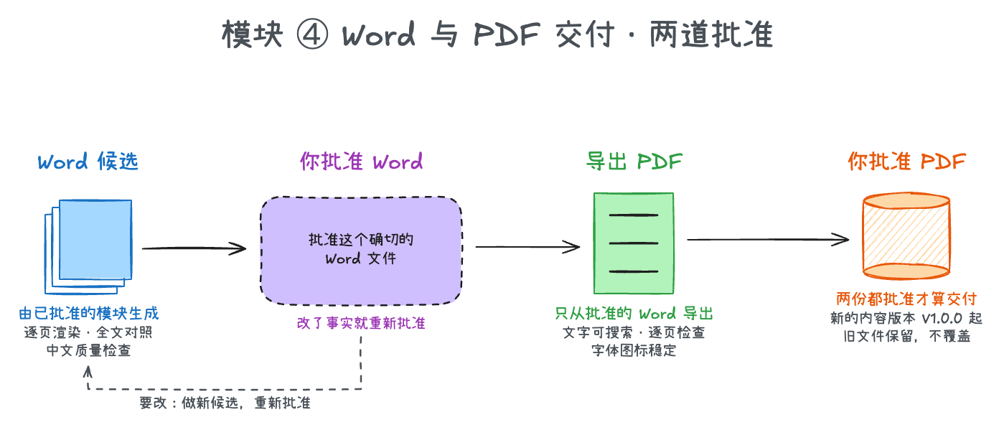
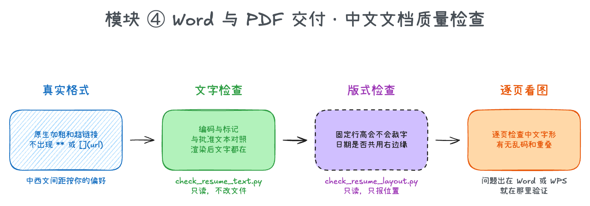

# resume-authoring 简历撰写

此SKILL灵感来自于天才Agent少女ASu

一份简历要改很多遍:换一个岗位改一遍,压成一页改一遍,中文改完再出英文。改着改着,最容易出问题的是这几件事:哪句话有出处,哪个数字是什么口径,哪一版才是你确认过的定稿。

这是一个给 AI 助手使用的技能包(Skill),帮你用**你自己的材料**写出一份可信、好读的简历,并且把"内容确认""Word 确认""PDF 确认"当成三件独立的事,一道一道过。经历、版式和事实都只来自你提供的材料。

## 我们解决的痛点和优势

写简历的麻烦集中在四件事上:格式要么死板,要么每次都要重排;AI 写出来的东西一读就是 AI;换一个岗位就得整份重来;经历一多,重点反而被淹没。这个 Skill 针对这四件事各有一套做法。

### 1. 标准化的格式,灵活的长度,按岗位调整

简历按固定的流程和版式生产:先出完整的长版,再压成措辞更短的压缩版,页数还是超了,才按岗位取舍出目标页数的短版。三种篇幅共用同一套格式规则,页数以实际渲染出来的为准。你投不同的岗位,可以让它按这个岗位的要求,包括 JD 里强调的能力,调整哪些经历放前面、哪些压短、哪些删掉。每一处取舍都记在删除账本里,内容不会悄悄丢掉。

### 2. 压住"AI味"

针对 AI 写作常见的毛病,Skill 把规则写成了一份共用的文风指南,评审和压缩两个环节都要遵守:

- **有话直接说。** 否定对照句式("不是……而是……"这一类)一律改成正面陈述。
- **标点克制。** 破折号只留给日期区间和已确认的标签,顿号只连接同类的短并列项。
- **每条要点是完整的句子。** 一串没有主语的短句要合并成有动作、有对象、有因果的一两句话。
- **没有空话。** "AI赋能""提升体验"这类口号、用技术名词堆出来的说明、防御性的假设和免责句子(比如"以上尚未作为已上线能力交付")都会被去掉。

每份草稿给你看之前,先用检查脚本扫一遍这些句式,再核对关键词、带单位的数字和因果关系,不添加你没有给出的事实。

### 3. 灵活的模板配置

你有自己的模板或已确认的版式,就按你的来;没有,就用 Skill 自带的默认版式(A4 紧凑简历,含页面、字体、间距、加粗等规则)。两者冲突时按属性逐项决定:你这一轮的明确要求优先于你的模板,你的模板优先于默认版式。已有文件只改你指出的那一项,整份版面保持原样。

### 4. 重点突出

Skill 会根据你的投递方向,从完整简历里挑出最相关的核心经历做压缩,不相关的合并或删去。版式上,重点项目和普通项目用不同的层级区分:分类标题和项目标题各有自己的颜色、字号和加粗,一眼能看出哪些是重点。这套重点版式在你选择,或你的参考版式里有时才启用,并且按项目实际做了什么来归类,不会为了好看硬造重点。

### 还有这些保证

- **先问清再动手**:目标岗位、地区、语言和页数要求,以及要 Word 还是 PDF,都先问你。有没有已确认的旧版也要问,文件名叫"final"并不说明它就是定稿。
- **每一条说法都有出处**:在你的工作区里建一份私有的事实账本。团队成果不会写成你一个人的,原型不会写成已上线,估算不会写成实测。
- **一次评审一个完整项目**:完整的原句和完整的建议稿并排给你看,你说"可以"才进下一个。
- **Word 和 PDF 各批一次**:先批准可编辑的 Word,PDF 只从批准的 Word 导出,再单独批准一次。
- **中文文档检查**:乱码、加粗不生效、日期没对齐、行高裁字,交付前用脚本和逐页看图各查一遍。

发布简历、替你投递、修改你的公开主页,这些事它都不做,需要你另行授权。

## 最终成品是什么?

每次你得到的是一组分了用途的简历文件,以及留在你自己工作区里的几份账本。

| 产物 | 里面是什么 | 什么时候用 |
|---|---|---|
| **长版简历**(Word 和 PDF) | 完整、逐个项目评审过的版本,是事实和措辞的来源 | 想把经历讲全、或者作为后面压缩的基础 |
| **压缩版简历** | 保留项目、事实、关键决策和结果,只是句子更短 | 页数要求能放下时,直接作为交付版 |
| **目标页数短版** | 压缩后仍超页数时,按岗位取舍、合并后的版本 | 有严格页数要求的投递 |
| **私有账本**(在你的工作区,不在仓库里) | 事实账本、审批记录、压缩时的覆盖账本、取舍时的删除账本 | 回溯某句话的出处,或判断哪一版已被批准 |
| **默认版式**(`assets/default-format.json`) | A4 紧凑简历的页面、字体、间距和加粗等规则 | 你没有自己的模板时兜底使用 |

除了 `samples/` 里那份完全虚构的示例,仓库里不包含任何人的简历、项目材料或个人路径,所有个人内容只在运行时放在你自己的工作区里。

### 成品展示

下面是用默认版式做出来的一份示例简历,两页。人物、学校、公司、项目和数字全部虚构,只用来展示版式和写法。可以看头部的信息层级,教育和工作经历的行样式,项目标题与要点的写法,以及"AI应用"这类重点分类和"数据产品与治理"这类普通分类在颜色和字号上的区别。

<table>
<tr>
<td width="50%"></td>
<td width="50%"></td>
</tr>
</table>

这份示例也是用本 Skill 自带的流程做出来的:先按默认版式生成 Word,再用 `normalize_cjk_spacing.py` 去掉中文与数字之间的自动间距,导出 PDF 后逐页看图,并通过文字、版式和文风三个检查脚本。可编辑的 Word 和导出的 PDF 都放在 [`samples/`](samples/),可以直接打开看。

## 模块与流程

这个 Skill 由四个模块按顺序工作:先搞清目标和材料,再逐个项目评审,然后在需要时压缩篇幅,最后经过两道批准交付 Word 和 PDF。



下面逐个讲每个模块做什么、内部怎么走。

### 模块 ① 材料与证据

**它做什么:** 弄清楚这份简历为谁而写,并给每一条说法建立可以追溯的证据。



AI 先确认目标岗位、受众所在地区、语言和页数要求,以及要不要同时交付 Word 和 PDF。它会明确问你有没有已确认的旧版,以及你已有的工作区习惯;你已有工作区就先问你是否沿用,没有才建议一套浅层的五区结构:素材、需求澄清、工作稿、已确认成品和治理记录。你标为禁区的文件夹,它不会去读。你如果给了一份想参考的版式,它只学版式的做法,参考对象的经历、数字和链接都不算你的事实。

然后它为每一条说法在私有账本里记六项:

- 出处
- 你本人的贡献
- 状态和日期(已上线、在做还是计划)
- 数字的口径和基线
- 用在哪个版本和语言
- 可信度

几份材料说法不一致时,它把两种说法摆给你看,只问能解决问题的最小问题;没解决的说法,不写进成品。

每个模块写完,它会给你看用到的证据、保留和舍弃的理由、建议的措辞,等你批准、修改或暂缓。批准了一个模块,不等于批准另一个模块、另一种语言,或者 Word 和 PDF。

### 模块 ② 逐项目评审

**它做什么:** 一次只评审一个完整项目,把原句和建议稿完整对照给你看,把反馈同步到所有地方。



AI 先认清这个项目的真实边界。同一个项目在不同材料里有不同叫法时,它合并处理,不会拆成虚构的条目。然后给你看两部分:**发现的问题,用完整原句**;**建议修改,用完整内容**,包括项目标题、日期、网址和每一段,不用省略号或摘要代替。链接和加粗在评审里就是真实的格式,不是一堆星号。

你回复"可以""确认"或"下一个",只算批准刚看的这一版。你要改,它改完再把完整的项目展示一遍。每一条改动会同步到账本、候选文件和已经用到的下游副本,并读回确认,不会在别处留着你已经否定的旧值。所有项目都批准(或你明确豁免)之后,才会生成 Word 候选;评审期间它不动你的简历文件。

写法上,每个建议稿给你看之前,先过一遍文风检查。它要求每个项目讲清楚面试官能评估的内容:产品要解决谁的什么问题,你负责什么,关键的产品和技术选择是什么、为什么,数据从哪来、怎么处理,结果用什么口径量的。有依据才写,没有依据的维度不硬凑。

### 模块 ③ 压缩与篇幅

**它做什么:** 把已确认的长版压成更短的版本,并按页数要求决定是直接交付,还是进一步取舍。



默认顺序是:长版 → 压缩版 → 目标页数短版(需要时)。长版是事实和措辞的来源。压缩时它逐项目、逐句处理,在覆盖账本里给每一句找到去处:压成了哪句、并到了哪句,关键词、带单位的数字、因果关系有没有保留。压缩只缩短措辞,项目、事实、关键决策和结果都要留着;如果缩到读不懂了,就把最少必要的解释放回去。

压完之后用实际渲染出来的页数判断。达到你的页数要求就直接交付压缩版;超出的话,另行进入内容取舍:按岗位相关度、你的独立贡献和证据强度挑选、合并或删除,并在删除账本里记下删掉了什么、为什么。整个项目要不要保留是范围决定,不是改写句子,按你约定的确认方式来。你说过"这一轮可以不用逐个看",只对你说明的那一轮和范围有效,下一轮要重新授权。

### 模块 ④ Word 与 PDF 交付

**它做什么:** 把批准过的内容做成可编辑的 Word,你批准后再导出 PDF,你再批准一次,才算交付。



AI 用已批准的模块生成一个 Word 候选,逐页渲染、把全文和批准过的内容对照,确认字体、图标、页数和版面。你批准的是这个确切的 Word 文件;之后任何事实改动或重新导出,都会让受影响的批准在新版本上重新开始。

Word 批准后,PDF 只从这份 Word 导出,检查文字是否可搜索、每一页是否正常、字体和图标是否稳定,再请你单独批准一次。两份都批准了才算交付。第一次正式交付的简历内容版本从 `V1.0.0` 起,更早的草稿用 `0.x`;之前交付过的文件原样保留,改动会生成新的候选和新的版本,旧文件不会被覆盖。中英文各自独立批准;事实共用并核对,但不假设两种语言逐段对译。

格式上,优先级是:你这一轮的明确要求 → 你提供的模板或已选定的版式 → 默认版式,按属性逐项决定。要恢复或修复格式时,它会检查段落和字符的实际格式,而不是只看样式表,并保留原版式里"重点项目"和"普通项目"的不同层级。



交付前,中文文档还要过一轮专门的检查:加粗和链接是真实格式,而不是把 `**` 或 `[]()` 当文字留在文档里;用 `check_resume_text.py` 检查编码、标记,以及和批准文本的对照;用 `check_resume_layout.py` 检查固定行高会不会裁掉大字号、日期是否共用同一个右边缘。这两个脚本都只读,不改文件。检查通过之外,它还会逐页看图,问题出在 Word 或 WPS 里,就在那里验证。

## 我应该准备什么材料?

1. **你的素材**:旧简历、项目文档、成果证据,越原始越好。
2. **目标岗位信息**:岗位名称、JD,以及页数要求和语言。
3. **(可选)已确认的旧版或想参考的版式**,告诉它哪一份是真正确认过的。

然后对 AI 说一句"帮我写一份面向 XX 岗位的简历"就行。

## 我可以在哪些工具上使用?

任何能读取 Skill、并能创建 Word、导出 PDF 和渲染页面图片的 AI 工具,例如 Claude Code、Codex。

**推荐:让 AI 帮你安装。** 把这个仓库交给 AI,说"帮我把这个 Skill 装好"。

**手动安装:**

| 工具 | 复制到 | 装好后的完整路径示例 |
|---|---|---|
| Claude Code | 用户目录 `~/.claude/skills/` | `~/.claude/skills/resume-authoring/SKILL.md` |
| Codex | 用户目录 `~/.codex/skills/`(或项目里的 `.agents/skills/`) | `~/.codex/skills/resume-authoring/SKILL.md` |

把整个仓库目录复制过去,目录名用 `resume-authoring`。两个子 Skill(逐项目评审、压缩)在 `skills/` 下,跟着一起复制即可。

## 使用技巧

**怎么指挥 AI**

- **说清楚页数:** 第一次就告诉它是"必须正好几页""最多几页"还是"不限"。它会记住,以后不再问。
- **一个项目一个项目地来:** 想一次看几个学校项目,或者把一段工作经历合并成一项,可以直接说,它会照办;不说就是一次一个。
- **想少看几轮:** 可以明确说"这一轮压缩不用逐个给我看",它会照做并记下你的授权,但仍然做文字和版面检查。下一轮要不要免审,需要你再说。
- **改了事实就直说:** 你纠正了某个数字或说法,它会同步到所有用到的地方,不会再留着旧值。
- **中英文分开推进:** 你可以要求先把中文全部确认完,再做英文;共同的事实会带过去,但英文不是逐句翻译。

**每类产物怎么用**

- **长版**:留作源文件,不直接投。
- **压缩版或短版**:按岗位的页数要求投递。
- **Word**:可编辑的版本,评审和批准都针对它。
- **PDF**:投递和发送用,只会从你批准过的 Word 导出。

## FAQ

**它会不会替我编经历?** 不会。没有出处的说法不会写进成品;几份材料冲突时,它先问你,不会用听起来合理的内容填空。

**能直接套用别人的版式吗?** 可以参考版式的做法,但参考对象的经历、数字、链接和页数都不算你的。

**两种语言的简历怎么管?** 各自独立确认。事实会共用并核对,但中文和英文不当成一一对译的一对,除非你明确指定哪两份是一对。

**它会帮我投简历吗?** 不会,它只负责写和交付简历;投递可以接着用 [`job-application-assistant`](https://github.com/SilentLake-Tech-SkillHub/job-application-assistant)。

**边界:** 只使用你当前提供的材料,并且只在你自己的工作区里使用;你的材料、截图和个人路径不会进入 Skill 或公开仓库;发布简历、提交申请和修改你的公开主页都需要你另行授权。它没有固定模板,只处理简历这一件事。

## 附录:文件结构

```text
resume-authoring/
├── README.md
├── SKILL.md                              入口:先问清、评审关卡、长版/压缩版/短版、Word 与 PDF 两道批准
├── assets/
│   └── default-format.json               默认版式(A4 紧凑简历)的页面、字体、间距、加粗与日期对齐规则
├── samples/                              虚构的示例简历(Word 和 PDF)
├── docs/
│   ├── flow/                         模块总览图与各模块内部流程图
│   └── showcase/                     成品展示图
├── references/
│   ├── intake-and-evidence.md            素材盘点与私有事实账本的六项记录
│   ├── writing-and-layout.md             写法、信息层级与版式取舍
│   ├── prose-style.md                    文风指南:否定对照、破折号、顿号、无主语短句
│   └── approval-and-versions.md          工作区、审批状态机、版本与文件命名
└── skills/
    ├── resume-project-review/            逐项目评审、反馈同步、中文文档质量
    │   ├── references/chinese-quality.md 中文文档的检查清单
    │   └── scripts/                      check_resume_text.py、check_resume_layout.py、check_prose_style.py、normalize_cjk_spacing.py
    └── resume-compression/               逐项目压缩、覆盖账本、页数判断与取舍
```

本仓库由 [SilentLake-Tech-SkillHub](https://github.com/SilentLake-Tech-SkillHub) 维护。
